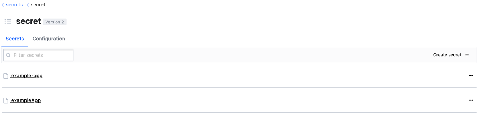
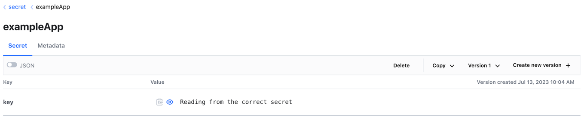
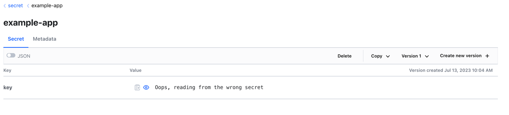

# Micronaut discovery client case conversion bug
## Steps
- Run vault in dev mode and make vault accessible at http://localhost:8200. Refer [here](https://developer.hashicorp.com/vault/docs/get-started/developer-qs).
- To create the secrets, run the terraform script inside create-vault-secrets.
  ```shell
  cd create-vault-secrets
  terraform init
  terraform apply
  ```
- Start the micronaut application by running `./gradlew run` from inside exampleApp directory.
- Go to the root of the micronaut application http://localhost:8080. If the correct secrets are read, you will be able to see "Reading from the correct secret". 
  Else, you will see "Oops, reading from the wrong secret" which shows that discovery client is reading from the secret example-app even though the application is named exampleApp.



